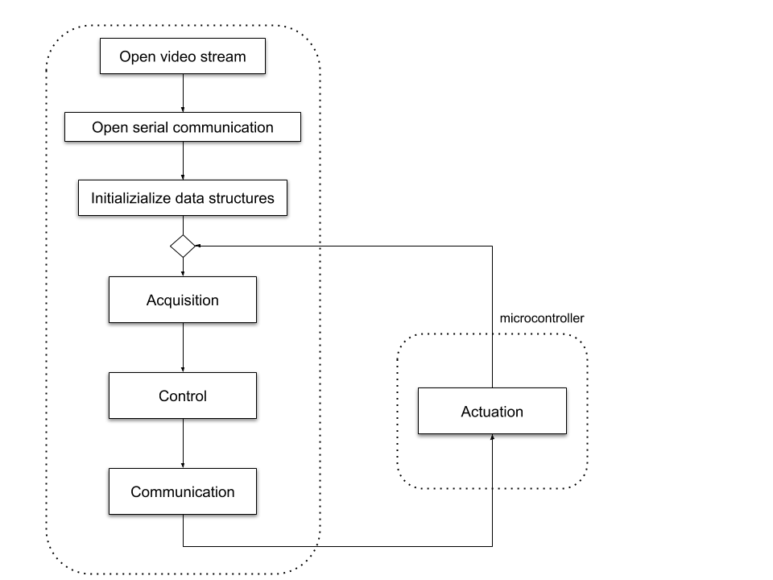
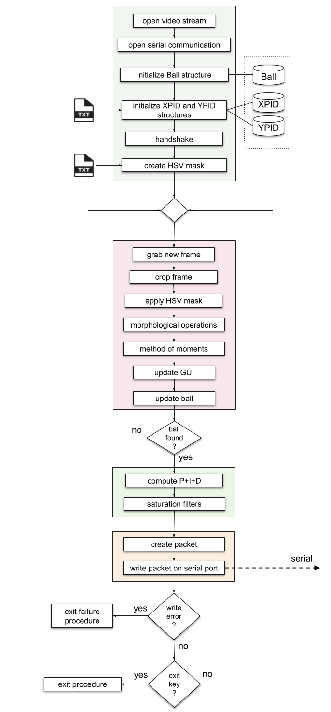
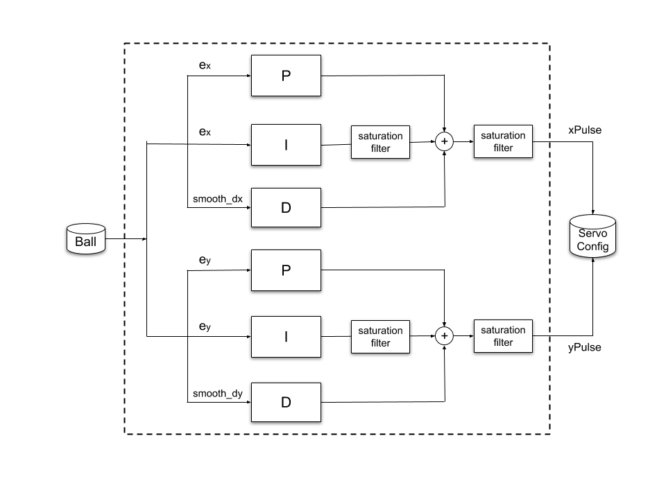

# Ball Balancing PID Systems
<p align="center">
  
</p>

## Table of contents
* [Project description](#project-description)
* [Hardware](#hardware)
* [Technologies](#technologies)
* [Software Workflow](#software-workflow)
* [Control System](#control-system)
* [How to use it](#how-to-use-it)

## Project description
The _Ball Balancing PID System_ is a cheap multidisciplinary project I developed in 2018 during my BSc in Automation Engineering.
This system holds a ball in balance on a 2-axis tiltable plate. A webcam is placed above the system, connected to a computer running a real time computer vision algorithm for ball detection. A feedback control law is computed by means of 2 PID controllers. Finally, a microcontroller actuates a pair a of servo motors, stabilizing the ball over the plate.
<p align="center">
  
</p>

The project is designed to be modular; there are 4 main stand-alone modules:

1. _**Computer Vision** Module_: acquires and preprocess ball position using OpenCV libs.

2. _**PID** Module_: filters and computes the control input through a digital PI-D.

3. _**Serial Communication** Module_: it provides communication beetwen PC and microcontroller.

4. _**Actuation** Module_: embedded software running on microcontroller. It uses interrupts to detects incoming packets and drives servo motors.

<p align="center">
  
</p>

## Hardware
* microcontroller: ATmega2560
* Servos: DS3218MG 5V-6.8V
* USB camera: 640x480
* Battery pack: 6V, 2850mAh

## Technologies
* OS: Ubuntu 16.04
* Language: C/C++
* Compilers: gcc 5.4.0, avr-gcc 4.9.2
* Additional libs: OpenCV 3.4.1
<p align="center">
  
</p>

## Software Workflow
General overview:
<p align="center">
  
</p>

PC side detailed workflow:
<p align="center">
  
</p>

# Control System
Double PID control scheme:
<p align="center">
  
</p>

## How to use it
Compile and run with one of this flag:

- **Standard mode**: better performance but minimal GUI  
```
"./run -s"
```

- **Setting mode**: set pid gains and computer vision parameters 	
```
./run -settings
```

- **Debug mode**: start debug mode: a better GUI and print utilities, little bit slower than standard mode
```
./run -debug
```

- **Manual mode**: platform can be controlled directly from terminal.	
```
./run -manual
```

*note: one and only one flag can be used*

<p align="center">
  
</p>
